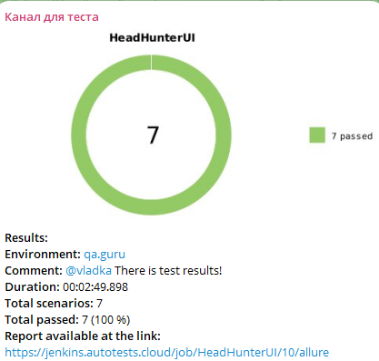

# <div align="center">[HeadHunter ](https://hh.ru/)</div>

> hh.ru — сервис, который помогает найти работу и подобрать персонал в Санкт-Петербурге более 20 лет! Создавайте резюме
> и откликайтесь на вакансии.

---

## <div align="center">Содержание</div>

* <a href="#project">Проект</a>
* <a href="#tools">Инструменты</a>
* <a href="#cases">Тестовое покрытие</a>
* <a href="#launch">Запуск</a>
* <a href="#allure">Интеграция с Allure</a>
* <a href="#allureTestOps">Интеграция с Allure TestOps</a>
* <a href="#telegramBot">Бот в Telegram</a>
* <a href="#video">Видео прохождения тестов</a>

---
<a id="project"></a>

## <a name="Проект">**Проект**</a>

> Целью проекта является задание на основе курса [QA GURU](https://qa.guru/)

- Написать автотесты
- Выложить проект на GitHub
- Создать задачу в Jenkins
- Вывести отчет в Allure
- Получить уведомление о прохождении тестов в Telegram Bot

<a id="tools"></a>

## <a name="Инструменты">**Инструменты**</a>

<p align="center">
<a href="https://www.jetbrains.com/idea/"></a>
<a href="https://www.jenkins.io/"></a>
<a href="https://github.com/"></a>  
<a href="https://www.java.com/"></a>
<a href="https://gradle.org/"></a>  
<a href="https://junit.org/junit5/"></a>
<a href="https://selenide.org/"></a>
<a href="https://github.com/allure-framework/"></a> 
<a href="https://telegram.org/"></a>
<a href="https://aerokube.com/selenoid/"></a>
</p>

---
<a id="cases"></a>

## <a name="Тестовое покрытие">**Тестовое покрытие**</a>

### Страница поиска
<p style="font-size:100%">
✅ Проверка вхождения хотя бы 1 записи в выдаче по поиску <br>
✅ Проверка подсказки при поиске<br>

### Главная страница
<p style="font-size:100%">
✅ Проверка открытия Главной страницы <br>
✅ Проверка регистрации при поиске на главной странице <br>
✅ Проверка Блока Вакансии из топ 12 <br>
✅ Переход на главную страницу из страницы поиска<br>
✅ Проверка капчи при вводе номера телефона с главной страницы<br>

---

<a id="launch"></a>

## <a name="Запуск">**Запуск**</a>

Для запуска локально в терминале нужно прописать:
> ./gradlew clean test

Так же тесты можно запустить через [Jenkins](https://jenkins.autotests.cloud/job/HeadHunterUI/)

В качестве параметров можно выбрать:

```  
- Разрешение экрана
- Версию браузера
```

---
<a id="allure"></a>

## <a name="Интеграция с Allure">**Интеграция с Allure**</a>

### <div align="center">Отчет о прохождении тестов в [Allure Report](https://jenkins.autotests.cloud/job/HeadHunterUI/10/allure/)</div>

<div align="center">
    
</div>

---

<a id="allureTestOps"></a>

## <a name="Интеграция с Allure TestOps">**Интеграция с Allure TestOps**</a>

Есть интеграция с [Allure TestOps](https://allure.autotests.cloud/launch/44034/tree/688781?treeId=8912)


---
<a id="telegramBot"></a>

## <a name="Бот в Telegram">**Бот в Telegram**</a>

<div align="center">
    
</div>

---

<a id="video"></a>

## <a name="Видео прохождения тестов">**Видео прохождения тестов**</a>

<div align="center">
    
</div>
